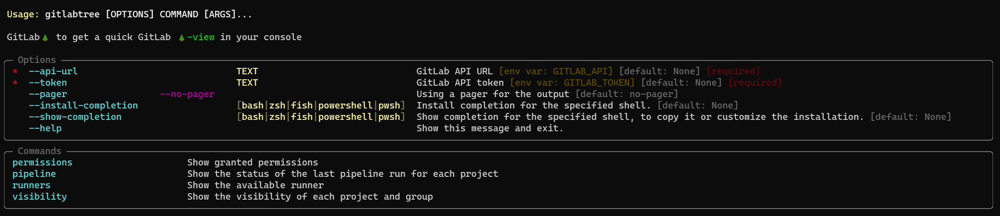
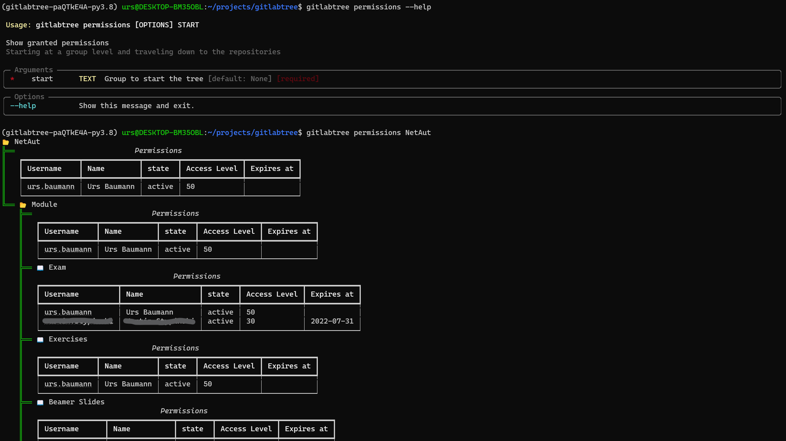
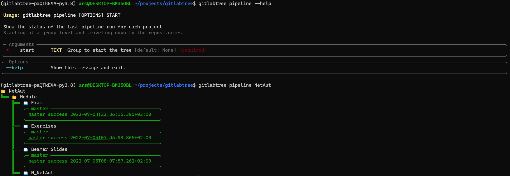
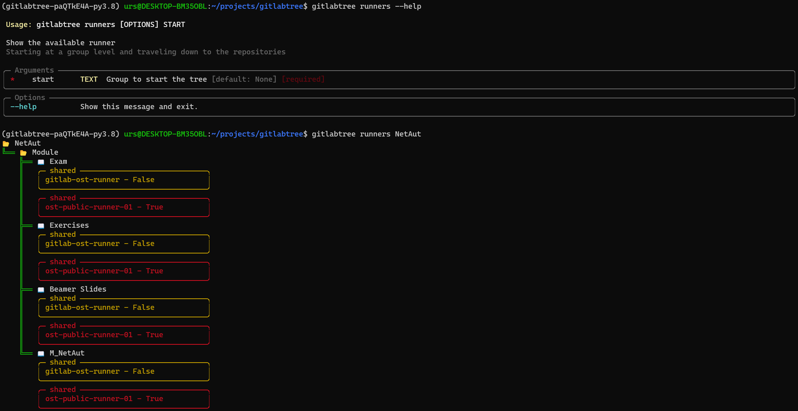
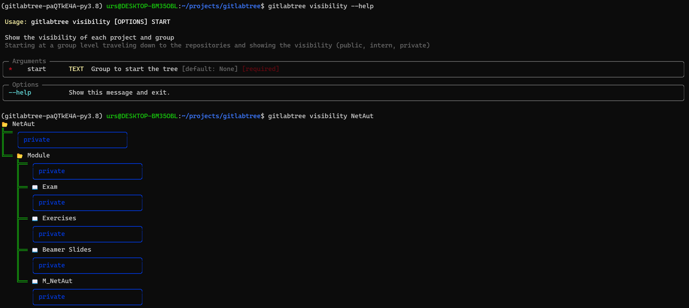

# GitLab🌲

GitLabTree is a CLI tool for retrieving information from a GitLab server. Mainly in a tree format, as the name suggests.


## Install

```
pip install gitlabtree
```

From source:
```
git clone
cd gitlabtree
poetry install
```

## Features

### Help



### Permissions



### Pipeline



### Runners



### Visibility



