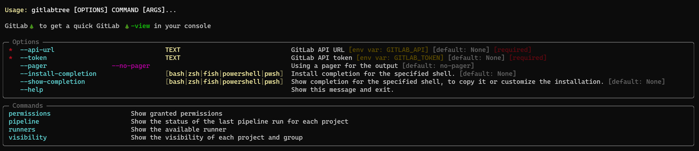
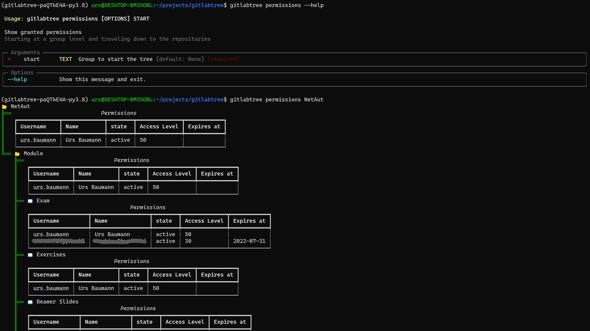
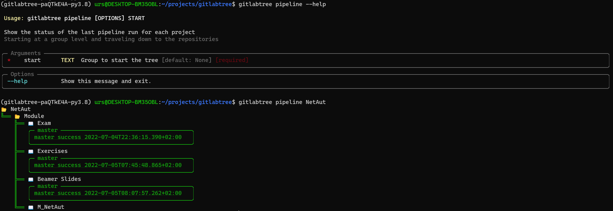
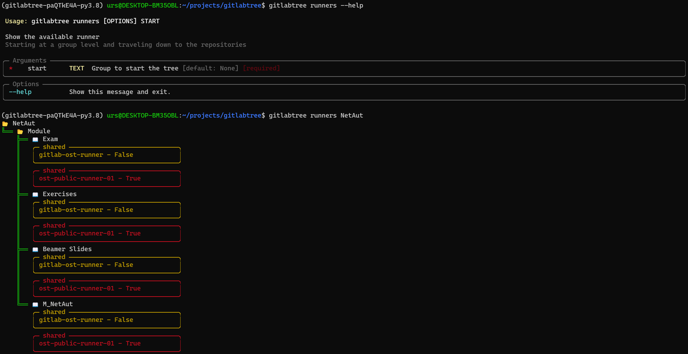
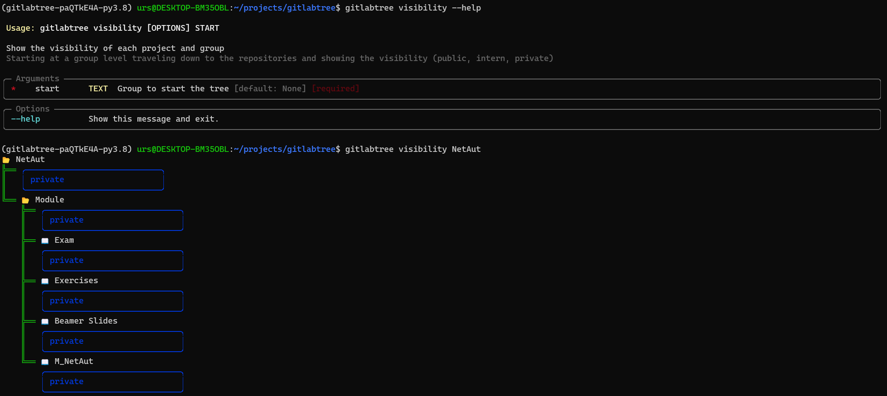

# GitLab🌲

GitLabTree is a CLI tool for retrieving information from a GitLab server. Mainly in a tree format, as the name suggests.


## Install

```
pip install gitlabtree
```

Or run directly with `uv` (requires [uv](https://github.com/astral-sh/uv)):
```
uvx gitlabtree
```

From source:
```
git clone
cd gitlabtree
uv sync
```

## Features

### Help



### Permissions



### Pipeline



### Runners



### Visibility


